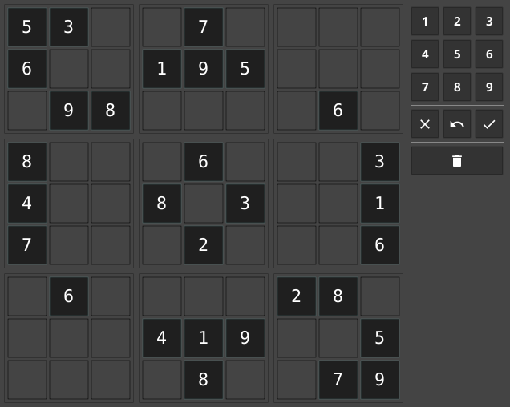

# Number Place

[](https://github.com/AlbinoGeek/number-place/blob/master/LICENSE)
[](https://github.com/AlbinoGeek/number-place)
[](https://codeclimate.com/github/AlbinoGeek/number-place/maintainability)  
[](#)
[](https://goreportcard.com/report/github.com/AlbinoGeek/number-place)
[](https://coveralls.io/github/AlbinoGeek/number-place?branch=develop)

[](cmd/testdata/start.png)

## Features

Share puzzles simply by copying a string:

```
3,3,3,3,53-6---98-7-195----------6-8--4--7---6-8-3-2---3--1--6-6----------419-8-28---5-79
```

Cells:

- Click/Tap Toggle Select
- Drag to Select Multiple
- Unlimited Undo Levels

Help:

- Highlights Simple Mistakes

### Keyboard Controls

With Cells Selected:

- Use the alpha keys or numpad to set the center value
- Use the `del`ete or `backspace` keys to clear all values

### Puzzles Supported

- [X] Sudoku
  - [X] Standard Grid (9x9, 3x3 boxes)
    - [X] Classic
    - [ ] Quadratum latinum (uses roman numerals for values)
    - [ ] Alphabetical (uses a key of letters for values)
  - [ ] Mini Grid (6x6, 3x2 boxes)
  - [ ] Giant Grid (16x16, 4x4 boxes)
- [ ] Constrainted-Based Gridded Sudoku:
  - [ ] Standard Grid (9x9, 3x3 boxes)
    - [ ] "Killer"
    - [ ] Greater Than
    - [ ] XV

If you know of a puzzle type not listed above, please [request it!](https://github.com/AlbinoGeek/number-place/issues/new?assignees=AlbinoGeek&labels=enhancement&template=feature-request.md&title=%5BFEATURE+REQUEST%5D)

## Usage

[Download a Release](https://github.com/AlbinoGeek/number-place/releases) or [Get the Sources](#building-from-source)

## Building From Source

1. Install Golang
1. Clone the repository
1. Run `make`

```bash
# Install Golang [apt / yum / dnf install golang]
$ git clone https://github.com/AlbinoGeek/number-place
$ cd number-place
$ make all
```

The binary will be built into the `_dist` directory.

## License

This project is licensed under the terms of the [MIT License](/LICENSE).
